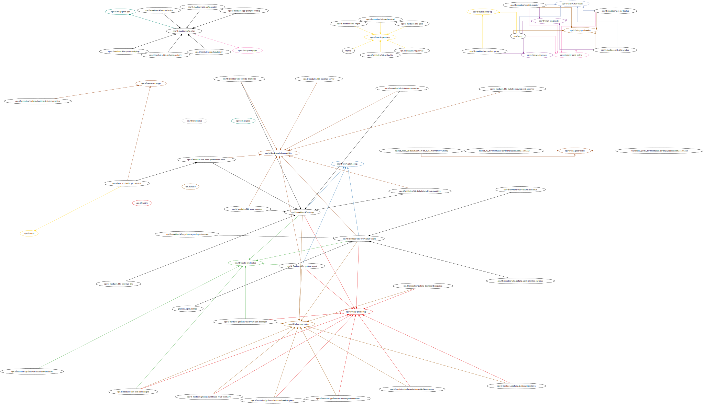

# `datacenter map`

## Deployment Map Example

>**Note**    
> This is an outdated deployment, its published here for illustrative purposes only



## Interchange Access List 


### Example

```jsonc
    "buh1": {  // Interchange Id
        "latlon": {
            "lat": 44.479805, // Latitude 
            "lon": 26.112683 // Longitude 
        },
        "city": "Bucharest",               // City
        "name": "NXDATA-1, Bucharest",     // Exchange Name
        "country": "Romania",             // Country 
        "pop": "buh1",                    // IdPoP
        "street": "8 Dimitrie Pompei Blvd",     // Address 
        "exchanges": ["INTERLAN", "RONIX", "Balcan-IX"]  // Exchanges Interchange
    },
```

### Twitter Handles

ASN/ISP Twitter Handles

```js
const ISP_TWITTER = [{
    "asn": "1",
    "handle": "CenturyLink"
}, {
    "asn": "2",
    "handle": "UDelaware"
}, {
    "asn": "3",
    "handle": "mit"
}, {
    "asn": "4",
    "handle": "usc"
}]
```
